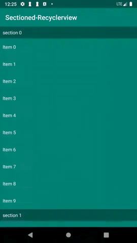

# Sectioned Recycler View
## Screenshot



## Import
### Extand `SectionAdapter` class and implement the following functions:

* `int numbersOfSections()`
* `int numberOfRowsInSection(int section)`
* `RecyclerView.ViewHolder onCreateSectionViewHolder(ViewGroup viewGroup, int section)`
* `RecyclerView.ViewHolder onCreateItemViewHolder(ViewGroup viewGroup, IndexPath indexPath)`
* `void onBindSectionViewHolder(RecyclerView.ViewHolder holder, int section)`
* `void onBindItemViewHolder(RecyclerView.ViewHolder holder, IndexPath indexPath)`

### Add an object of the extanded adapter to the recycler view

### Create instance of `StickHeaderItemDecoration` and attach it to the recyclerview
```
StickHeaderItemDecoration decoration = new StickHeaderItemDecoration();
recyclerView.addItemDecoration(decoration);
```
> **Note:** Attach the `StickHeaderItemDecoration` to the recycler view only after the recycler view has adapter that instance of `SectionAdapter`